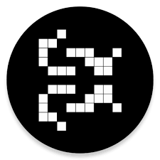

[![Contributors][contributors-shield]][contributors-url]
[![Forks][forks-shield]][forks-url]
[![Stargazers][stars-shield]][stars-url]
[![Issues][issues-shield]][issues-url]
[![MIT License][license-shield]][license-url]
[![LinkedIn][linkedin-shield]][linkedin-url]

<!-- PROJECT LOGO -->
 

  

  <h3 align="center">GAME OF LIFE</h3>

  

    it can simulate a universal constructor or any other Turing machine.
     
    <a href="https://en.wikipedia.org/wiki/Conway%27s_Game_of_Life"><strong>Explore the docs »</strong></a>
     
     
    <a href="https://github.com/miladxdev/game-of-life">View Demo</a>
    ·
    <a href="https://github.com/miladxdev/game-of-life/issues">Report Bug</a>
    ·
    <a href="https://github.com/miladxdev/game-of-life/issues">Request Feature</a>
  

`screenshot`

[![Product Name Screen Shot][product-screenshot]](https://example.com)

<!-- ABOUT THE PROJECT -->

# [LIVE DEMO](https://miladxdev.github.io/game-of-life/) ☝

## About The Project

The Game of Life, also known simply as Life, is a cellular automaton devised by the British mathematician John Horton Conway in 1970. It is a zero-player game, meaning that its evolution is determined by its initial state, requiring no further input. One interacts with the Game of Life by creating an initial configuration and observing how it evolves. It is Turing complete and can simulate a universal constructor or any other Turing machine.

### Built With

- `JAVASCRIPT`

<!-- USAGE EXAMPLES -->

## Usage

_For more information, please refer to the [Wikipedia](https://en.wikipedia.org/wiki/Conway%27s_Game_of_Life)_

<!-- ROADMAP -->

## Roadmap

See the [open issues](https://github.com/miladxdev/game-of-life/issues) for a list of proposed features (and known issues).

<!-- CONTRIBUTING -->

## Contributing

Contributions are what make the open source community such an amazing place to be learn, inspire, and create. Any contributions you make are **greatly appreciated**.

1. Fork the Project
2. Create your Feature Branch `git checkout -b feature/AmazingFeature`
3. Commit your Changes `git commit -m 'Add some AmazingFeature'`
4. Push to the Branch `git push origin feature/AmazingFeature`
5. Open a Pull Request

<!-- CONTACT -->

## Contact

`Milad Gharibi`

email: miladxdev@gmail.com

Project Link: [github.com/miladxdev/game-of-life](https://github.com/miladxdev/game-of-life)

<!-- MARKDOWN LINKS & IMAGES -->
<!-- https://www.markdownguide.org/basic-syntax/#reference-style-links -->

[contributors-shield]: https://img.shields.io/github/contributors/miladxdev/game-of-life.svg?style=for-the-badge
[contributors-url]: https://github.com/miladxdev/game-of-life/graphs/contributors
[forks-shield]: https://img.shields.io/github/forks/miladxdev/game-of-life.svg?style=for-the-badge
[forks-url]: https://github.com/miladxdev/game-of-life/network/members
[stars-shield]: https://img.shields.io/github/stars/miladxdev/game-of-life.svg?style=for-the-badge
[stars-url]: https://github.com/miladxdev/game-of-life/stargazers
[issues-shield]: https://img.shields.io/github/issues/miladxdev/game-of-life.svg?style=for-the-badge
[issues-url]: https://github.com/miladxdev/game-of-life/issues
[license-shield]: https://img.shields.io/github/license/miladxdev/game-of-life.svg?style=for-the-badge
[license-url]: https://github.com/miladxdev/game-of-life/blob/master/LICENSE.txt
[linkedin-shield]: https://img.shields.io/badge/-LinkedIn-black.svg?style=for-the-badge&logo=linkedin&colorB=555
[linkedin-url]: https://www.linkedin.com/in/itsmilad/
[product-screenshot]: img/screenshot.png
